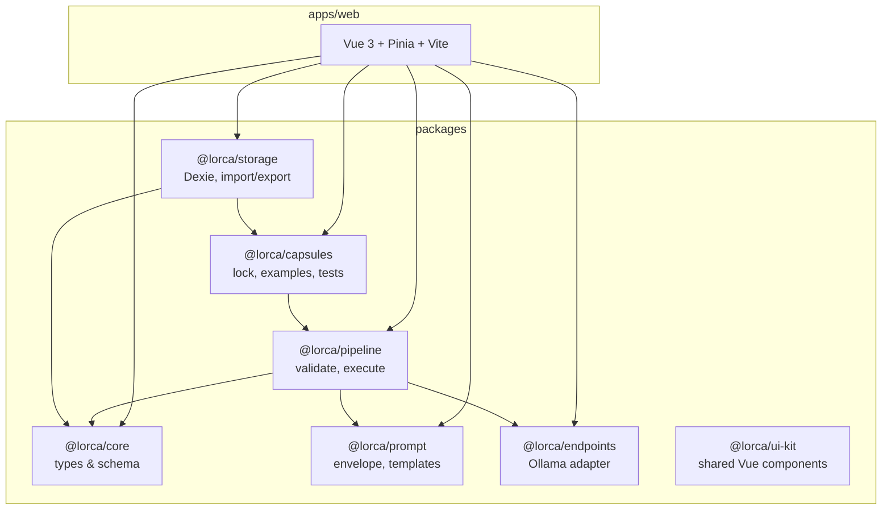

<p align="center">
  
</p>

# Lorca

**Local AI Orchestrator** — a browser-first workbench for designing, executing, and iterating on local AI pipelines.

Lorca lets you register local model endpoints (for example [Ollama](https://ollama.com)), discover models, wrap prompts in structured tags, chain preprocessing and model calls, reuse flows as **Capsules**, and inspect every intermediate artifact from a single run. Execution, validation, and persistence run in the browser; there is no required backend.

---

## Table of contents

- [Why Lorca](#why-lorca)
- [Features](#features)
- [Quick start](#quick-start)
- [Using the app](#using-the-app)
- [Architecture](#architecture)
- [Monorepo layout](#monorepo-layout)
- [Core concepts](#core-concepts)
- [Pipeline node types](#pipeline-node-types)
- [Built-in example Capsules](#built-in-example-capsules)
- [Import and export](#import-and-export)
- [Browser and endpoint requirements](#browser-and-endpoint-requirements)
- [Development](#development)
- [Testing](#testing)
- [Runtime limits](#runtime-limits)
- [Roadmap](#roadmap)
- [Further reading](#further-reading)

---

## Why Lorca

Many local-AI tools focus on chat or autonomous agents. Lorca is a **pipeline workbench**: you own the graph structure, model choices, prompt wrappers, intermediate transforms, reusable Capsules, and the final model call. The goal is to build and refine multi-step flows iteratively—extract intent, generate acceptance criteria, verify an answer—while seeing exactly what each step produced.

The project grew out of work on Smartazz and related pipeline experiments: rather than extracting a pipeline into a separate library first, Lorca is the environment where those flows are designed and tested step by step.

---

## Features

| Area | What you can do |
| --- | --- |
| **Endpoints** | Add AI endpoints (Ollama is fully supported today), test browser access, discover models, or add models manually |
| **Model buckets** | Auto-suggest usage buckets (`tiny`, `thinking`, `summarize`, `rewrite`, `extract-json`, `verify`, `general`) and override per model |
| **Pipelines** | Ordered step-chain editor with XML prompt blocks, history reads, partial runs, and stale indicators |
| **Prompts** | Wrap the target prompt in `<user_prompt>…</user_prompt>`, add tagged instruction wrappers and templates |
| **Model calls** | Insert generate/chat steps anywhere; later steps consume artifacts from earlier steps |
| **Capsules** | Reusable mini-pipelines with a public interface; lock, version, test, and insert multiple instances |
| **Loops** | Run a Capsule instance a fixed number of times (up to 10) with carried input/output |
| **Execution** | Run the pipeline in dependency order; trace panel shows per-step status, inputs, and outputs |
| **Persistence** | Save pipelines, Capsules, endpoints, and models in IndexedDB (`lorca` database) |
| **Import / export** | JSON files for pipelines and Capsules, with model/Capsule remap on import |
| **Step Suggestions** | Eight built-in insertable step recipes (Intent Extraction, Acceptance Criteria, and more) |

**Not in scope for the current MVP:** mandatory server, MCP/tools, cloud sync, multi-user mode, autonomous agent loops, or a sharing marketplace.

---

## Quick start

### Prerequisites

- **Node.js** ≥ 24 (see `engines` in root `package.json`)
- **npm** (workspaces monorepo)
- A local AI endpoint reachable from the browser — typically **Ollama** at `http://localhost:11434`
- For Ollama from the browser, CORS must allow your Lorca origin (see [Browser and endpoint requirements](#browser-and-endpoint-requirements))

### Install and run

```bash
git clone https://github.com/ctrl-escp/lorca.git lorca
cd lorca
npm install
npm run dev
```

Open the URL Vite prints (default **http://localhost:5173**).

### Minimal first run

1. In the left pane, expand **Endpoints** and add an endpoint (e.g. name `Local Ollama`, URL `http://localhost:11434`).
2. Click **Test access**, then **Discover models** (or add a model manually under **Models**).
3. Enter a **target prompt** in the center pane.
4. Add steps (wrappers, model calls, Capsules) as needed.
5. Click **Execute** and inspect the trace and output in the right pane.

---

## Using the app

### Layout

Lorca uses a three-pane shell:

```
┌─────────────────────────────────────────────────────────────────┐
│  Lorca — Local AI Orchestrator                    [run status]  │
├──────────────┬──────────────────────────────┬───────────────────┤
│  Left pane   │  Center pane                 │  Right pane       │
│              │                              │                   │
│  Step        │  User prompt + step chain    │  Step inspector   │
│  Suggestions │  editor (or Capsule editor)  │  Trace / Output   │
│  Capsules    │                              │                   │
│  Models      │  (or Capsule editor)         │  Trace            │
│  Endpoints   │                              │  Final output     │
└──────────────┴──────────────────────────────┴───────────────────┘
```

- **Left:** Step Suggestions, your Capsules, models and buckets, endpoints.
- **Center:** user prompt, ordered step chain, execute / run-up-to / undo-redo.
- **Right:** step inspector, execution trace, resolved output.

### Capsule editing

Open a Capsule from the left pane to switch the center pane into **Capsule editor** mode. The header shows a breadcrumb (`← Pipeline › Capsule name`). Capsules use the same step-chain editor as pipelines and expose a **public interface** (inputs, outputs, parameters, model slots) for use inside larger flows. Test runs support run-up-to and the same trace/output panels as pipelines.

### Typical workflow

1. Register and test endpoints.
2. Discover or manually register models; adjust buckets if needed.
3. Enter the user’s target prompt (creates `user_prompt.raw` and `user_prompt.xml` artifacts).
4. Add wrappers, templates, model calls, JSON extraction, or Capsule instances.
5. Wire each step’s inputs to prior artifacts (via artifact refs in node config).
6. **Execute** — inspect artifacts and trace; iterate on structure or prompts.
7. Save (automatic via IndexedDB) or export JSON for sharing.

---

## Architecture

Lorca is an **npm workspaces** monorepo. Shared logic lives in `packages/*`; the Vue 3 UI lives in `apps/web`.



**Design principles:**

- **Browser-first:** validation, prompt rendering, `fetch` to endpoints, artifacts, and traces run client-side.
- **One graph model:** pipelines and Capsules are the same node/edge/artifact abstraction; Capsules add a boundary and public interface.
- **Optional backend later:** CORS bypass, secrets, MCP, and LAN serving are explicitly out of scope for the MVP.

---

## Monorepo layout

```
lorca/
├── apps/
│   └── web/                 # Vue 3 SPA (Vite)
│       ├── src/
│       │   ├── components/  # panes, pipeline, capsule, endpoints, import
│       │   ├── composables/
│       │   ├── stores/      # Pinia: pipelines, capsules, endpoints, runs, …
│       │   └── utils/
│       └── tests/           # Playwright smoke tests
├── packages/
│   ├── core/                # Pipeline & Capsule TypeScript types, errors
│   ├── prompt/              # User prompt envelope, templates, tag rules
│   ├── endpoints/           # Endpoint adapters (Ollama implemented)
│   ├── pipeline/            # validatePipeline, executePipeline, artifacts
│   ├── capsules/            # Capsule validate/execute/lock, built-in examples
│   ├── storage/             # Dexie DB, JSON import/export
│   └── ui-kit/              # Shared Vue UI primitives (FieldLabel, dialogs)
├── docs/                    # Product pitch and implementation plan
├── package.json             # Workspace root scripts
├── vitest.config.ts
└── eslint.config.mjs
```

### Package responsibilities

| Package | Role | Status |
| --- | --- | --- |
| `@lorca/core` | Domain types: `PipelineDefinition`, `CapsuleDefinition`, nodes, edges, artifacts, traces, export file shapes | ✅ Implemented |
| `@lorca/prompt` | `buildUserPromptArtifacts`, `renderPromptWrapper`, `renderTemplate`, XML/tag helpers | ✅ Implemented |
| `@lorca/endpoints` | `testBrowserAccess`, `listModels`, `executeModelCall`; `ollamaAdapter` + bucket heuristics | ✅ Implemented |
| `@lorca/pipeline` | `validatePipeline`, `topologicalOrder`, `executePipeline`, artifact key helpers | ✅ Implemented |
| `@lorca/capsules` | `validateCapsule`, `executeCapsuleTestRun`, locking/versioning, built-in examples | ✅ Implemented |
| `@lorca/storage` | IndexedDB via Dexie; pipeline/Capsule export, parse, import preview/remap | ✅ Implemented |
| `@lorca/ui-kit` | Shared Vue UI primitives (`FieldLabel`, `ConfirmDialog`, `PromptDialog`) | ✅ Implemented |
| `@lorca/web` | Application UI and stores | ✅ Implemented |

---

## Core concepts

### Pipeline

A **pipeline** is the top-level runnable flow: nodes, edges, an `inputArtifactName`, and an `outputRef` pointing at the final artifact to display. The MVP UI presents a mostly linear chain; internally the representation is graph-shaped.

### Capsule

A **Capsule** is a reusable subgraph—typically preprocess → model call → postprocess, but flexible. It defines:

- **Public interface:** input ports, output ports, parameters, model slots
- **Internal nodes/edges** (hidden behind the instance boundary at run time)
- **Status:** `draft` or `locked` (locked Capsules are read-only; duplicate to edit)

A **Capsule instance** node in a pipeline references a Capsule definition by id/version, binds inputs to parent artifacts, maps outputs to prefixed keys, and optional **loop** config.

### Artifact

An **artifact** is an immutable named value produced during a run (e.g. `user_prompt.raw`, `criteria.extracted_json`). Keys are namespaced by node `artifactPrefix` to avoid collisions when the same Capsule appears twice. Capsule **internal** artifacts live under `${prefix}.internal.*` and are visible in the trace but not promoted to the parent namespace unless bound as public outputs.

### Trace

Each node execution emits **trace events** (`started`, `completed`, `failed`, …) with timestamps, duration, and artifact names. The UI trace panel is the primary debugging surface.

---

## Pipeline node types

| Type | Purpose |
| --- | --- |
| `input` | Seeds global `user_prompt.raw` / `user_prompt.xml` from the target prompt |
| `prompt-wrapper` | Wraps an artifact in a custom XML tag with instructions |
| `template` | Renders a string template against artifacts (`{{artifact.key}}`) |
| `model-call` | Calls an endpoint model (fixed ref or Capsule slot); outputs `text` / `rawResponse` |
| `json-extract` | Parses JSON from a prior text artifact |
| `manual-text` | Injects static text as an artifact |
| `capsule-instance` | Runs a Capsule subgraph inside the parent pipeline |

Edges connect node outputs to downstream inputs. The executor runs nodes in topological order.

---

## Built-in example Capsules

Duplicate any example from the left pane to create an editable draft. The eight built-ins are:

| ID | Name |
| --- | --- |
| `example-intent-extraction` | Intent Extraction |
| `example-acceptance-criteria` | Acceptance Criteria Generation |
| `example-candidate-answer` | Candidate Answer |
| `example-answer-verification` | Answer Verification |
| `example-summary` | Summary |
| `example-prompt-rewrite` | Prompt Rewrite |
| `example-constraint-extraction` | Constraint Extraction |
| `example-drift-check` | Drift Check |

Built-in suggestion recipes are backed by `@lorca/capsules` (`getBuiltinExamples()`, `duplicateExampleCapsule()` for cloning into user-owned drafts).

---

## Import and export

- **Export:** download pipeline or Capsule JSON (`PipelineExportFile` / `CapsuleExportFile`, `schemaVersion: 1`, `app: "lorca"`).
- **Import:** parse file, preview missing model/Capsule references, remap to local ids, then apply.
- Pipelines may embed referenced Capsules in `includedCapsules`.

Import UI: left-pane import buttons and `ImportRemapDialog` when references need resolution.

---

## Browser and endpoint requirements

### CORS

The browser must be allowed to call your endpoint’s HTTP API. If access is blocked, Lorca surfaces an endpoint-access error. Remedies:

1. Configure the endpoint for local browser access (Ollama: set `OLLAMA_ORIGINS` or equivalent for your dev origin).
2. Add models **manually** without discovery.
3. (Future) use an optional local backend bridge.

Lorca does not bypass CORS silently.

### Supported endpoint kinds

| Kind | Status |
| --- | --- |
| `ollama` | **Implemented** — discovery (`/api/tags`), generate, chat |
| `openai-compatible` | Schema/UI only; no adapter in registry yet |
| `lmstudio` | Schema/UI only |
| `custom-http` | Schema/UI only |

### Ollama tip

```bash
# Example: allow Vite dev server (adjust origin as needed)
export OLLAMA_ORIGINS=http://localhost:5173
ollama serve
```

---

## Development

### Scripts (repository root)

| Command | Description |
| --- | --- |
| `npm run dev` | Start Vite dev server (`apps/web`) |
| `npm run build` | Typecheck all workspaces (`tsc --noEmit` / `vue-tsc`) |
| `npm run lint` | ESLint across the repo |
| `npm test` | Vitest unit tests (`packages/*/tests`) |
| `npm run test:watch` | Vitest in watch mode |
| `npm run test:e2e` | Playwright tests (starts dev server if needed) |
| `npm run validate` | `lint` + `build` + `test` |

### Web app only

```bash
npm run dev --workspace=apps/web
npm run build --workspace=apps/web
npm run preview --workspace=apps/web
```

### GitHub Pages

Pushes to `main` run [`.github/workflows/deploy-pages.yml`](.github/workflows/deploy-pages.yml): build `apps/web`, set `VITE_BASE_PATH` to `/<repo>/` (or `/` for `username.github.io`), and deploy via GitHub Pages. Enable **Settings → Pages → GitHub Actions** on the repository before the first deploy succeeds.

### Tech stack

- **UI:** Vue 3, Pinia, Vite 6, TypeScript
- **Storage:** Dexie (IndexedDB database name: `lorca`)
- **Tests:** Vitest (jsdom), MSW in endpoint tests, Playwright for smoke E2E
- **Lint:** ESLint 9 flat config, TypeScript ESLint, `eslint-plugin-vue`

### TypeScript

Packages export TypeScript sources directly (`"main": "./src/index.ts"`). The web app resolves workspace packages via npm workspaces. Shared compiler options live in `tsconfig.base.json`.

---

## Testing

### Unit tests

```bash
npm test
```

Covers schema validation, prompt rendering, pipeline/capsule execution, Ollama adapter (mocked fetch), storage import/export, and example Capsule integrity.

### End-to-end smoke tests

```bash
# Install Playwright browsers once
npx playwright install chromium

npm run test:e2e
```

Playwright runs against `http://localhost:5173`, mocks Ollama HTTP routes, and clears IndexedDB between tests. Scenarios include adding endpoints, discovering models, building chains, executing pipelines, and Capsule workflows.

---

## Runtime limits

Defaults enforced by `@lorca/core` and the executor:

| Limit | Value | Notes |
| --- | --- | --- |
| Max Capsule loop count | `10` | `CAPSULE_LOOP_MAX_COUNT` |
| Model call timeout | `120_000` ms | Per call; cancel aborts in-flight fetch |
| Recent run retention | `20` | Older runs pruned from persisted history |
| Trace preview size | `32_768` chars | Longer bodies truncated in UI |

---

## Roadmap

Planned or documented for later phases (see `docs/`):

- MCP and tool execution
- Additional endpoint adapters (OpenAI-compatible, LM Studio, custom HTTP)
- Optional local backend (CORS proxy, secrets, streaming proxy, filesystem)
- Visual graph overview of the full pipeline
- Capsule sharing marketplace
- Deeper Smartazz-style structure templates

---

## Further reading

| Document | Contents |
| --- | --- |
| [`docs/00-lorca-init-pitch.md`](docs/00-lorca-init-pitch.md) | Original product vision and MVP sketch |
| [`docs/01-lorca-init-plan.md`](docs/01-lorca-init-plan.md) | Full implementation plan: artifacts, Capsules, UX, phases, DoD |

---

## License

No project license file is checked in yet. Dependencies are predominantly MIT/Apache-2.0; add a `LICENSE` at the repository root before public distribution.
