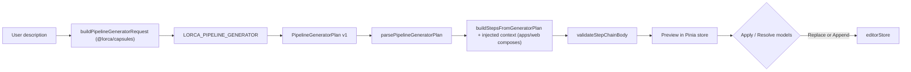

# Improve “Build from description”

Plan for turning the pipeline generator from a **suggestion picker** into a **pipeline author**: custom steps, tailored prompts, model selection, capsule reuse, and a usable apply flow.

This is **cross-package work** — not a modal refactor. Packages involved: `@lorca/capsules`, `@lorca/endpoints`, `@lorca/pipeline`, `@lorca/prompt`, `@lorca/core`, and `apps/web`.

---

## Problem statement

The current feature asks one model call to output `[{ "suggestionId": "…" }]`. That:

- Cannot express custom multi-role flows (debate, expert panels, iterative rounds).
- Copies fixed suggestion prompts — nothing is tailored to the user’s description.
- Leaves model refs empty; the user must remap models manually before apply.
- Shows a label-only preview with little signal about quality.

**Acceptance example** (from `docs/tmp-notes.md`): a theoretical-question pipeline that extracts a hypothesis, spins up three domain experts (pro / con / judge), runs a second argumentative round, then summarizes. This cannot be built with today’s suggestion-ID output.

---

## Goals

1. **Write the pipeline** — produce a runnable step chain, not just a list of catalog IDs.
2. **Reuse when useful** — pick built-in suggestions, role prompts, or capsules when they fit; otherwise author custom steps.
3. **Select models** — assign a concrete model per step (or per capsule slot) from enabled endpoints/models, with bucket fallback.
4. **Write prompts** — per-step instructions appropriate to the user’s goal.
5. **Better apply UX** — rich preview, validation before apply, explicit model resolution, re-run when output is weak.

## Non-goals (this iteration)

- Automated multi-pass “plan then refine” inside a single Generate click (user re-runs manually instead).
- MCP / tool steps.
- Import/export format changes (generator output schema is separate from pipeline import format).
- Marketplace or sharing flows.
- Generator capsule dropdown (only one built-in generator exists today).

---

## Package layout (required before coding)

Move non-UI generator logic **out of `apps/web`**. Packages must **not** import from `apps/web/src/utils`.

### Acyclic dependency rule

**Existing fact:** `@lorca/capsules` already depends on `@lorca/pipeline` (and `@lorca/prompt`). Therefore:

- **`@lorca/pipeline` must not import `@lorca/capsules`** — would create a cycle.
- **`@lorca/prompt` must not import `@lorca/capsules`** — would create a cycle (`capsules → prompt` already).

Phase 0 must prove these graphs stay acyclic before any generator logic lands.

### Module ownership

| Layer | Location | Responsibility |
| --- | --- | --- |
| **Schema + parse + build orchestration** | `@lorca/pipeline/src/generator/` | Versioned plan types, parser, ref grammar validation, recursive step counting, stub detection, **`buildStepsFromGeneratorPlan` (generic — no capsule imports)** |
| **Suggestion + capsule catalog data** | `@lorca/capsules` | `ALL_SUGGESTIONS`, `instantiateSuggestion`, locked capsule metadata, **`buildRolePromptCatalog()`** (sources suggestions + examples already in this package) |
| **Role prompt types + pure helpers** | `@lorca/prompt` | `StepRolePromptTemplate` type, `dedupeStepRolePromptTemplates`, `truncatePromptPreview` — **no capsules import** |
| **Model catalog + assignment** | `@lorca/endpoints` | `buildGeneratorModelCatalog`, `resolveGeneratorModelAssignments({ steps, requests })` — maps plan `modelId` / `modelBucket` / `slotModels` to fixed refs |
| **Request assembly** | `@lorca/capsules` | `buildPipelineGeneratorRequest()` — catalogs, ref grammar spec, pipeline context, refine payload (`capsules → pipeline` is already one-way) |
| **Composition + UI** | `apps/web` | Pinia session store, modal, preview, apply/append, **Resolve models** CTA, remap wiring; **injects resolvers** into `buildStepsFromGeneratorPlan` |

**Allowed dependency direction:**

```
apps/web → pipeline, endpoints, prompt, capsules, storage
capsules → pipeline, prompt, endpoints, core   (existing)
pipeline/generator → core only                  (validateStepChainBody stays in pipeline root)
pipeline (root) → core, prompt, endpoints       (existing)
endpoints → core
prompt → core only
```

Retire parse/build functions in `apps/web/src/composables/usePipelineGenerator.ts`; keep a thin composable that orchestrates the capsule test run, wires resolvers, and calls package APIs.

### Injected builder resolvers

`buildStepsFromGeneratorPlan` in `@lorca/pipeline/generator` must **not** call `@lorca/capsules` or `@lorca/endpoints` directly. It accepts a **`GeneratorBuildContext`** (or equivalent) with injected callbacks:

```ts
interface GeneratorBuildContext {
  allowCapsules: boolean;
  applyMode: 'replace' | 'append';
  existingPipeline?: PipelineDefinition; // for current:* refs + append inputSource

  /** suggestionId → instantiated steps (wraps instantiateSuggestion) */
  instantiateSuggestion: (suggestionId: string, existingNamespaces: Set<string>, existingSteps: PipelineStep[]) => PipelineStep[] | null;

  /** rolePromptId → full prompt text */
  getRolePrompt: (rolePromptId: string) => string | null;

  /** capsuleId + version → definition (for binding validation) */
  resolveCapsule: (capsuleId: string, capsuleVersion: string) => CapsuleDefinition | undefined;

  /**
   * Apply generator-requested models to materialized steps.
   * `requests` preserves plan-level modelId / modelBucket / slotModels — do not infer from empty step refs alone.
   */
  resolveModelAssignments: (input: {
    steps: PipelineStep[];
    requests: GeneratorModelAssignmentRequest[];
  }) => {
    steps: PipelineStep[];
    unresolved: UnresolvedModelRef[];
  };
}

/** Collected during build — one row per model-call step or capsule slot. */
interface GeneratorModelAssignmentRequest {
  stepId: string;
  stepKey: string;
  modelId?: string;
  modelBucket?: ModelUsageBucket;
  /** capsule-instance only: slotName → requested model */
  slotModels?: Record<string, { modelId?: string; modelBucket?: ModelUsageBucket }>;
}
```

`apps/web` (or a thin `apps/web/src/generator/composeGeneratorBuild.ts` helper) wires these from `@lorca/capsules`, `@lorca/prompt`, and `@lorca/endpoints`. Unit tests in `@lorca/pipeline/tests/generator/` supply **mock resolvers** — no capsules package required in parser/builder invariant tests.

### Parse vs build validation

| Phase | Validates (no catalog knowledge required) |
| --- | --- |
| **Parse** | Wrapper schema, `schemaVersion`, recursive entry count, unique `stepKey`, ref grammar, forward refs, `current:*` vs apply mode, capsule kind when `allowCapsules: false` |
| **Build** | Catalog ids via injected resolvers (`instantiateSuggestion` → null = unknown suggestion; `getRolePrompt` → null = unknown role prompt; `resolveCapsule` → undefined = unknown capsule), model assignment via `requests`, `validateStepChainBody` |

Optional: inject a `validateSuggestionId` into parse for early rejection — **not planned for v1**; invalid `suggestionId` is a **build error**.

Move `stepRolePromptCatalog` **out of `apps/web/src/utils`**: types/helpers → `@lorca/prompt`; **`buildRolePromptCatalog()`** → `@lorca/capsules` (data already lives there). Web re-exports or calls capsules for the generator request.

---

## Locked product decisions

All product questions are resolved. Implementation should follow this section.

### Apply mode: replace **or** append

| Mode | Behavior |
| --- | --- |
| **Replace pipeline** | `editorStore.replaceSteps(…)` — wipes existing steps. **Default.** |
| **Append to current** | Insert generated steps **after the last step** in the current chain. |

Default is always **Replace**. Append must be a single undo entry.

### Modal session persistence

Closing the modal **does not** clear generator session state. Re-open shows description, preview, raw response, warnings/errors, and toggle states.

State persists until **Clear all** or until the user explicitly clears. **Successful Apply** commits to the editor but **keeps** session state for iteration.

**Lifecycle:** session state lives in a **Pinia store** (`pipelineGenerator` or similar), not in a composable destroyed with the modal. Alternative: keep the modal mounted and hidden — Pinia is preferred.

### Re-run instead of auto-refine

User clicks **Generate again**. Optional **Refine previous plan** checkbox (default **off**): when on, include previous plan JSON + validation/build errors.

### Current pipeline context

Send current pipeline summary unless `isDefaultPipelineStub(pipeline)` is true.

**Do not** use “single model-call step” as the stub heuristic — real one-step pipelines exist. Stub detection uses an explicit predicate (see **Stub detection** below).

### Prompt authoring modes

| Mode | Meaning |
| --- | --- |
| **`catalog`** | Use existing role prompt verbatim (`rolePromptId`). |
| **`custom`** | Replace system prompt completely. |

Omit `rolePromptId` on a suggestion → keep suggestion default prompt. Role prompt catalog in LLM context uses **full text**.

### Capsules — opt-in via UI toggle

Default **off**. Catalog: **locked capsules only**. Generated instances: **`displayMode: "opaque"`**. Reject `kind: "capsule"` in parser/build when toggle was off at generation time (store toggle in session; re-validate on build).

### Generator model

Always **`LORCA_PIPELINE_GENERATOR`** + `selectPipelineGeneratorModel()`. Drop modal dropdown.

### Apply gating and model resolution UX

Two distinct gates:

| Condition | UX |
| --- | --- |
| Validation errors (`validateStepChainBody`, ref grammar, parse errors) | **Apply disabled.** Fix via re-run / refine. |
| Unresolved model refs | **Apply disabled.** Separate **Resolve models…** button enabled → opens `ImportRemapDialog`; on confirm, update preview refs; then Apply enables. |

Do **not** rely on a disabled Apply button to open remap — that is unreachable. **Resolve models…** is the entry point when models are missing but the plan is otherwise valid.

### Legacy format

Drop in one cut. Only versioned wrapper schema (below).

### Step count limits

| Limit | Value |
| --- | --- |
| Soft cap (prompt instruction) | **12** expanded steps unless description clearly needs more |
| Hard reject (parser) | **25** expanded steps **recursively** |

Recursive count includes every nested loop body entry and **each executable step** a capsule instance materializes (count capsule as 1 plan entry but validate expanded inner step count if caps apply to “executable steps” — use plan-entry count for hard cap: 1 capsule entry = 1 toward cap; loop nesting counts all nested entries).

**Rule:** `countPlanEntries(plan, { recursive: true }) > 25` → parse error.

### Presentation / summary steps

`presentation` **already exists** in `@lorca/core`, `@lorca/pipeline` (execution, validation, template refs). No new step kind required — generator emits `kind: "presentation"` and builder maps to existing `PipelineStep`. Template text uses canonical ref grammar (below), converted to `{{artifact.namespace.output}}` at build time.

---

## Generator output schema

### Versioned wrapper (not a bare array)

```ts
interface PipelineGeneratorPlan {
  schemaVersion: 1;
  steps: GeneratorPlanEntry[];
  assumptions?: string[];  // planner notes surfaced in preview
  warnings?: string[];     // e.g. "no verify bucket model available"
}
```

Future migrations bump `schemaVersion` without another breaking cut. Parser rejects unknown versions with a clear message.

Legacy bare `[{ "suggestionId": … }]` arrays are rejected.

### Canonical ref grammar

One typed ref model reused everywhere — no ad-hoc `"expert_pro.text"` strings mixed with template syntax in the plan JSON.

```ts
/** Reference to an output in the generated plan or existing pipeline. */
type GeneratorArtifactRef =
  | { scope: 'generated'; stepKey: string; output: string }   // generated:expert_pro.text
  | { scope: 'current'; namespace: string; output: string }; // current:answer.text (append mode)

// Serialized in JSON (LLM-facing):
// "generated:expert_pro.text"
// "current:answer.text"
```

**Rules:**

- `stepKey` must be **globally unique** across the plan, including inside loop bodies.
- **No forward refs** — referenced `stepKey` must appear earlier in depth-first plan order.
- `current:*` refs allowed only when append mode is selected **and** pipeline context was sent (non-stub).
- Parser validates grammar; builder resolves `generated:*` via `stepKey → outputNamespace` map and `current:*` via existing pipeline namespaces.
- At build time, presentation templates and capsule bindings convert refs to Lorca `{{artifact.<namespace>.<output>}}` form.

**History reads** on custom model-call steps use the same refs:

```json
{
  "kind": "custom",
  "stepKey": "expert_pro",
  "historyReads": [
    { "ref": "generated:hypothesis.text", "tagName": "hypothesis" }
  ]
}
```

Replace separate `historyFrom` / binding string formats with `ref` strings (or structured objects that serialize to the same grammar).

### First-step input source

`includePreviousOutput` only applies when a prior step exists in the **generated** chain or when append mode wires to the existing pipeline.

Explicit field on the **first** generated model-call step (and optionally others):

```ts
type InputSource =
  | 'user'              // runtime user input / pipeline input (replace mode default for first step)
  | 'previous-step'     // positional previous output in generated chain
  | 'current-pipeline-last'; // append mode: last output of existing pipeline

// Default rules (builder applies if omitted):
// replace mode, first generated model-call → inputSource: 'user'
// append mode, first generated model-call → inputSource: 'current-pipeline-last' (or 'user' if explicitly set)
```

Document in generator prompt; builder sets `previousOutput.enabled` + placement accordingly.

### Plan entry kinds

Each entry in `steps[]` has a `kind` discriminator.

#### `kind: "suggestion"`

```json
{
  "kind": "suggestion",
  "stepKey": "intent",
  "suggestionId": "suggestion-intent-extraction",
  "label": "Optional relabel",
  "prompt": { "mode": "catalog", "rolePromptId": "role-abc123" }
}
```

#### `kind: "custom"`

```json
{
  "kind": "custom",
  "stepKey": "expert_pro",
  "label": "Expert — support hypothesis",
  "inputSource": "user",
  "prompt": { "mode": "custom", "text": "You are a domain expert…" },
  "modelId": "ep-local::llama3.2:latest",
  "modelBucket": "general",
  "outputType": "text",
  "historyReads": [
    { "ref": "generated:hypothesis.text", "tagName": "hypothesis" }
  ]
}
```

#### `kind: "capsule"` (toggle on)

```json
{
  "kind": "capsule",
  "stepKey": "verify",
  "capsuleId": "example-answer-verification",
  "capsuleVersion": "v1",
  "label": "Verify answer",
  "inputBindings": { "candidate": "generated:expert_pro.text" },
  "outputBindings": { "verdict": "generated:verify.verdict" },
  "slotModels": { "verifier": { "modelId": "ep-local::qwen2.5:14b" } }
}
```

#### `kind: "loop"`

```json
{
  "kind": "loop",
  "stepKey": "round_two",
  "label": "Second debate round",
  "maxIterations": 1,
  "exitCondition": { "type": "iterations" },
  "steps": [ "… nested entries …" ]
}
```

#### `kind: "presentation"`

```json
{
  "kind": "presentation",
  "stepKey": "summary",
  "label": "Debate summary",
  "text": "Summary:\n\nHypothesis: {{generated:hypothesis.text}}\n\n…"
}
```

Builder converts `{{generated:…}}` / `{{current:…}}` to standard artifact templates.

---

## Stub detection

```ts
function isDefaultPipelineStub(pipeline: PipelineDefinition): boolean
```

True only when **all** of:

- `pipeline.name === 'New Pipeline'` (default name)
- `pipeline.input.raw === ''` and default input config (`user_prompt` namespace, `user` tag)
- Exactly one step: `type === 'model-call'`, `label === 'Model Call'`, `outputNamespace === 'answer'`
- Empty model ref (`endpointId === ''` && `modelName === ''`)
- No prompt blocks edited (or `lastEditedAt` equals pipeline `createdAt` within tolerance — prefer checking absence of custom prompt)

Real user one-step pipelines fail at least one check (custom label, prompt, model, name, or dirty input).

Unit tests: stub vs real one-step pipeline must diverge.

---

## Target architecture



### Builder pipeline (`@lorca/pipeline/generator`)

1. Parse wrapper; validate `schemaVersion`, recursive entry count ≤ 25, global unique `stepKey`, ref grammar, no forward refs.
2. Reject capsule entries if `context.allowCapsules === false`.
3. Walk entries depth-first; maintain `stepKey → { stepId, outputNamespace }` map.
4. Materialize steps via injected resolvers (suggestion → `instantiateSuggestion`; catalog prompts → `getRolePrompt`; capsule defs → `resolveCapsule`).
5. Apply `inputSource` defaults for first model-call.
6. Wire `historyReads` from canonical refs.
7. Collect `GeneratorModelAssignmentRequest[]` from plan entries (per-step `modelId` / `modelBucket`, capsule `slotModels`); call injected `resolveModelAssignments({ steps, requests })`.
8. Run `validateStepChainBody` with the same `resolveCapsule`; return structured build result (steps, errors, unresolvedModels, assumptions, warnings).

### Apply flow (`apps/web`)

1. After Generate: store build result in Pinia; render preview + assumptions/warnings.
2. If validation errors → Apply disabled; show errors per step.
3. If unresolved models → Apply disabled; **Resolve models…** enabled → remap dialog → update stored steps.
4. Apply enabled only when valid + all models resolved.
5. Replace or append; switch to inspector; **keep** Pinia session.

### Generator capsule

Update `LORCA_PIPELINE_GENERATOR` prompt for wrapper schema, ref grammar, `inputSource`, entry kinds. `maxTokens` ≥ **4096**. Catalogs injected via `buildPipelineGeneratorRequest()` in `@lorca/capsules`.

---

## UI changes (`PipelineGeneratorModal`)

| Control | Purpose |
| --- | --- |
| Description | persisted in Pinia |
| **Apply mode** | Replace (default) / Append |
| **Allow capsule steps** | Toggle, default off |
| **Refine previous plan** | Checkbox, default off |
| Generate | Run / re-run |
| **Resolve models…** | Opens remap when models unresolved; enabled independently of Apply |
| Apply | Commit when valid + models resolved |
| **Clear all** | Reset Pinia session |
| Preview | Steps, models, prompts, refs, assumptions, warnings, validation errors |

Remove Generator dropdown. Close modal = hide only.

---

## Implementation phases

### Phase 0 — Package scaffolding (blocking)

- Add `@lorca/pipeline/src/generator/` (types, refs, parse, count, build skeleton + `GeneratorBuildContext`).
- Move role prompt **types/helpers** to `@lorca/prompt`; add **`buildRolePromptCatalog()`** to `@lorca/capsules`.
- Add `@lorca/endpoints` generator model catalog + assignment helpers.
- Add `buildPipelineGeneratorRequest()` to `@lorca/capsules` (not pipeline — avoids cycle).
- Add `composeGeneratorBuildContext()` in `apps/web` wiring capsules/endpoints resolvers.
- Add Pinia `pipelineGenerator` store in `apps/web`.
- Wire exports.

**Phase 0 acceptance (must pass before Phase 1):**

```bash
npm run build
```

Plus a dependency audit proving:

- **No package imports from `apps/web`** (grep / small script under `packages/`).
- **No `@lorca/pipeline` ↔ `@lorca/capsules` cycle** — `pipeline` must not list `capsules` in `package.json`; `capsules` may depend on `pipeline`.
- **No `@lorca/prompt` ↔ `@lorca/capsules` cycle** — `prompt` must not list `capsules` in `package.json`.

Suggested check (add as `scripts/check-package-deps.mjs` or similar in Phase 0):

```bash
# pipeline must not depend on capsules
! grep -q '"@lorca/capsules"' packages/pipeline/package.json
# prompt must not depend on capsules
! grep -q '"@lorca/capsules"' packages/prompt/package.json
# packages must not import apps/web
! rg "apps/web" packages/ --glob '!**/tests/**'
```

**DoD:** `npm run build` green; dependency checks pass; empty parse/build compiles with mock resolvers.

### Phase 1 — Schema, parser, ref validation

- Implement `PipelineGeneratorPlan` v1 + all entry kinds.
- Parser with recursive count, duplicate `stepKey`, forward ref, capsule-when-disabled rejection.
- `isDefaultPipelineStub()`.
- Update generator capsule prompt template.
- **Invariant tests** (see below).

**DoD:** Parser tests green; legacy bare array rejected.

### Phase 2 — Step builder

- `buildStepsFromGeneratorPlan(plan, context)` for all kinds using injected resolvers.
- `composeGeneratorBuildContext()` in apps/web for production wiring.
- Ref resolution → history reads + presentation templates + capsule bindings.
- `inputSource` defaults.
- `validateStepChainBody` integration.
- Golden fixture: debate example with **mock resolvers** in pipeline tests; full integration test in apps/web or capsules tests with real `instantiateSuggestion`.

**DoD:** Debate fixture builds and validates without LLM.

### Phase 3 — Model resolution

- Model catalog in request builder.
- `resolveGeneratorModelAssignments({ steps, requests })` in endpoints (wired as `context.resolveModelAssignments`).
- Preview surfaces unresolved refs; **Resolve models…** flow in web.

**DoD:** Model assignment + remap path works end-to-end in UI.

### Phase 4 — Modal UX + Pinia session

- Session persistence, Clear all, toggles, remove dropdown.
- Apply vs Resolve models gating.
- Append/replace apply.

**DoD:** Manual QA checklist (below).

### Phase 5 — Generator prompt tuning

- Examples using wrapper schema + ref grammar.
- Soft cap 12 in instructions.

### Phase 6 — Integration tests

- Debate prompt manual checklist with local model.
- Optional MSW e2e later.

---

## Invariant tests (required)

Positive-path fixtures alone are insufficient. Add in `@lorca/pipeline/tests/generator/`:

| Case | Expected |
| --- | --- |
| Duplicate `stepKey` (incl. across loop nesting) | Parse error |
| Recursive entry count > 25 | Parse error |
| `kind: "capsule"` when `allowCapsules: false` | Parse/build error |
| Invalid `suggestionId` (`instantiateSuggestion` returns null) | Build error |
| Invalid `rolePromptId` | Build error |
| Invalid `modelId`, no bucket | Unresolved model; bucket fallback if bucket valid |
| Invalid `modelId`, with valid `modelBucket` | Resolves via auto-select |
| Invalid capsule port in binding | Build/validation error |
| Invalid presentation ref | Build/validation error |
| Forward ref (`generated` to later stepKey) | Parse error |
| `current:*` ref in replace mode | Parse error |
| `current:*` ref in append mode with stub pipeline | Parse error |
| Append mode + valid `current:*` ref | Builds; binding resolves to existing namespace |
| `isDefaultPipelineStub` true for `createDefaultPipeline()` | true |
| Real one-step user pipeline (custom label/prompt) | stub false |
| Unknown `schemaVersion` | Parse error |
| Bare array input (legacy) | Parse error |

---

## Test plan (manual)

Use debate prompt from `docs/tmp-notes.md`:

1. Enable endpoint; discover models.
2. Generate → preview with assumptions/warnings if any.
3. If models missing → **Resolve models…** → Apply enables.
4. Apply (replace) → run pipeline.
5. Close/reopen modal → session intact.
6. Refine previous plan + re-generate.
7. Clear all → reset.
8. Append on non-stub pipeline with `current:*` refs.
9. Capsule toggle on/off behavior.
10. Apply blocked on validation errors (no Resolve models shortcut).

---

## Risks and mitigations

| Risk | Mitigation |
| --- | --- |
| **`pipeline` ↔ `capsules` dependency cycle** | Generator builder uses injected resolvers only; request builder lives in capsules; Phase 0 dep audit |
| **`prompt` ↔ `capsules` dependency cycle** | Role prompt data built in capsules; prompt owns types/helpers only |
| Schema drift across packages | Single source of types in `@lorca/pipeline/generator` |
| Ref grammar ambiguity | One parser; no stringly bindings in builder |
| Loop hidden step explosion | Recursive count at parse time |
| Stub false negative/positive | Explicit multi-field predicate + tests |
| Session lost on navigation | Pinia store, not composable-local state |
| Disabled Apply blocks remap | Separate **Resolve models…** CTA |

---

## Definition of done

- [ ] Generator logic in packages; `apps/web` is UI + composition + orchestration only.
- [ ] **No `pipeline` ↔ `capsules` or `prompt` ↔ `capsules` cycles**; Phase 0 dep checks in CI or `npm run validate`.
- [ ] `buildStepsFromGeneratorPlan` uses injected resolvers; pipeline does not import capsules.
- [ ] `PipelineGeneratorPlan` v1 wrapper; no legacy bare array.
- [ ] Canonical ref grammar enforced; no forward refs.
- [ ] Recursive ≤25 entry cap.
- [ ] `inputSource` on first step; append/replace defaults correct.
- [ ] `isDefaultPipelineStub()` — not single-step heuristic.
- [ ] Presentation via existing step kind; templates use ref grammar.
- [ ] Pinia session persistence + Clear all.
- [ ] Resolve models… + Apply gating (no UX contradiction).
- [ ] All invariant tests listed above.
- [ ] Debate acceptance manual checklist passes.

---

## Suggested commit series

1. Phase 0: package scaffolding + dep audit script + Pinia store + role prompt split (types→prompt, data→capsules) + mock-resolver build skeleton
2. Phase 1: parser + ref validation + invariant tests (mock resolvers)
3. Phase 2: builder + composeGeneratorBuildContext + debate golden fixture
4. Phase 3: endpoints model resolution + Resolve models UX
5. Phase 4–5: modal polish + generator prompt tuning
